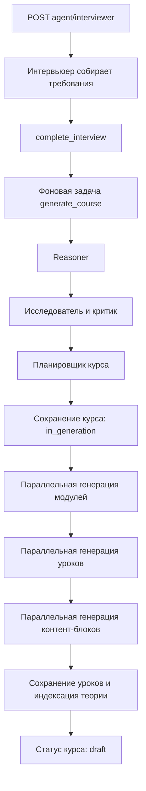

# API ИИ-агентов модуля Courses

Документ описывает HTTP API и внутреннее устройство ИИ-агентов из модуля `src/courses`.

## Содержание

- [Общая информация](#общая-информация)
- [Краткий список HTTP-эндпоинтов](#краткий-список-http-эндпоинтов)
- [Общая модель чата](#общая-модель-чата)
- [Агент-интервьюер](#агент-интервьюер)
- [Агент-редактор](#агент-редактор)
- [Агент-ментор](#агент-ментор)
- [Форматы контент-блоков редактора](#форматы-контент-блоков-редактора)
- [История диалога](#история-диалога)
- [Ошибки](#ошибки)
- [Внутренние агенты генерации курса](#внутренние-агенты-генерации-курса)
- [Агенты тестов и практик](#агенты-тестов-и-практик)
- [Известные ограничения текущей реализации](#известные-ограничения-текущей-реализации)

## Общая информация

Базовый префикс API:

```text
/api/v1
```

Все публичные эндпоинты агентов требуют JWT access token:

```http
Authorization: Bearer <access_token>
Content-Type: application/json
```

Для большинства endpoints используется `Content-Type: application/json`. Проверка файловой практики (`/agent/check/practice/{module_id}/{lesson_id}`) принимает файл и должна отправляться как upload-запрос; подробнее см. раздел [Проверка практики](#проверка-практики).

Помимо аутентификации, каждый endpoint проверяет наличие отдельного системного права (`permission`) через `require_permissions(...)`. Требуемое право зависит от типа агента и указано в таблице ниже.

Идентификатор пользователя не передаётся в теле запроса. Сервер получает его из JWT и использует как `user_id` в контексте агента.

Все публичные методы агентов используют `POST`, потому что каждый вызов добавляет сообщение в диалог и может обращаться к LLM, базе данных, базе знаний или генератору изображений.

## Краткий список HTTP-эндпоинтов

| Метод  | URL                                                    | Агент      | Требуемое право      | Назначение                                                                                |
| ------ | ------------------------------------------------------ | ---------- | -------------------- | ----------------------------------------------------------------------------------------- |
| `POST` | `/api/v1/agent/interviewer`                            | Интервьюер | `course.create`      | Собирает требования к курсу и после завершения интервью запускает фоновую генерацию курса |
| `POST` | `/api/v1/agent/editor`                                 | Редактор   | `course.update`      | Перегенерирует отдельный контент-блок урока с учётом остальных материалов                 |
| `POST` | `/api/v1/agent/mentor`                                 | Ментор     | `course.course_read` | Отвечает студенту с учётом переданных клиентом контент-блоков курса                       |
| `POST` | `/api/v1/agent/test/{module_id}/{lesson_id}`           | Тестер     | `course.course_read` | Генерирует тест по теории урока и предыдущим практикам студента                           |
| `POST` | `/api/v1/agent/check/test/{module_id}/{lesson_id}`     | Тестер     | `course.course_read` | Проверяет выполненный тест и возвращает балл с AI-feedback                                |
| `POST` | `/api/v1/agent/practice/{module_id}/{lesson_id}`       | Практик    | `course.course_read` | Генерирует практическое задание с загрузкой файла                                         |
| `POST` | `/api/v1/agent/check/practice/{module_id}/{lesson_id}` | Практик    | `course.course_read` | Проверяет загруженный файл по условиям практического задания                              |

## Общая модель чата

Интервьюер принимает модель `Chat`. Модели `EditorChat` и `MentorChat` расширяют её дополнительными полями, описанными в разделах соответствующих агентов.

### Поля запроса

| Поле        | Тип                     | Обязательное | Значение                                                                                                                                                                                    |
| ----------- | ----------------------- | -----------: | ------------------------------------------------------------------------------------------------------------------------------------------------------------------------------------------- |
| `chat_id`   | `UUID`                  |          нет | Идентификатор диалога. Если поле не передано, сервер создаёт UUID, однако для продолжения диалога клиент должен сохранять `chat_id` из первого ответа и передавать его в следующих запросах |
| `course_id` | `UUID`                  |           да | Идентификатор курса, к которому относится диалог                                                                                                                                            |
| `role`      | `"user" \| "assistant"` |          нет | По умолчанию `"user"`. В текущей реализации входное значение не влияет на вызов агента: `content` всегда передаётся модели как сообщение пользователя                                       |
| `content`   | `string`                |           да | Текст сообщения или инструкция агенту                                                                                                                                                       |

### Общий формат ответа

```json
{
  "chat_id": "9f3e898d-6fc3-4e78-97da-bd6835094909",
  "course_id": "2fe0ce96-e7dd-48b5-953f-80f77377cb5c",
  "role": "assistant",
  "content": "Текст ответа агента"
}
```

В ответах HTTP API поле `role` всегда равно `"assistant"`.

## Агент-интервьюер

```http
POST /api/v1/agent/interviewer
```

**Успешный статус:** `200 OK`
**Требуемое право:** `course.create` (`CREATE`) — создание курса.

### Зачем нужен

Интервьюер помогает преподавателю сформулировать требования к новому курсу. Он ведёт многошаговый диалог, уточняет тему, целевую аудиторию, уровень подготовки, цели, ограничения и желаемую структуру курса.

После сбора достаточной информации агент завершает интервью и ставит полную генерацию курса в фоновую очередь Dramatiq.

### Как работает

1. Загружает сохранённую историю по комбинации `user_id + course_id + chat_id`.
2. Нормализует текст сообщений с помощью лемматизации.
3. При необходимости изучает загруженные пользователем документы через инструменты:
   - `get_table_of_contents` — получить оглавления документов пользователя;
   - `get_titles` — получить заголовки выбранного документа;
   - `get_content` — получить текст выбранного раздела.
4. Задаёт уточняющие вопросы, пока не соберёт требования.
5. Вызывает `complete_interview`, который отправляет задачу `generate_course` в фоновую очередь.
6. Сохраняет обновлённую историю чата.

На один экземпляр агента установлены ограничения вызовов инструментов:

| Инструмент              | Максимум вызовов |
| ----------------------- | ---------------: |
| `complete_interview`    |                1 |
| `get_table_of_contents` |                3 |
| `get_titles`            |                6 |
| `get_content`           |               12 |

При достижении примерно `70 000` токенов история суммаризируется перед следующим обращением к модели.

### Тело запроса

Используется [общая модель `Chat`](#общая-модель-чата).

```json
{
  "chat_id": "9f3e898d-6fc3-4e78-97da-bd6835094909",
  "course_id": "2fe0ce96-e7dd-48b5-953f-80f77377cb5c",
  "role": "user",
  "content": "Хочу создать курс по Python для аналитиков, которые раньше работали только в Excel"
}
```

Первое сообщение можно отправить без `chat_id`:

```json
{
  "course_id": "2fe0ce96-e7dd-48b5-953f-80f77377cb5c",
  "content": "Хочу создать курс по Python для аналитиков"
}
```

### Ответ во время интервью

```json
{
  "chat_id": "9f3e898d-6fc3-4e78-97da-bd6835094909",
  "course_id": "2fe0ce96-e7dd-48b5-953f-80f77377cb5c",
  "role": "assistant",
  "content": "Какой уровень владения программированием у будущих студентов и какие задачи они должны научиться решать после курса?"
}
```

### Ответ после запуска генерации

Когда агент вызвал `complete_interview`, HTTP API возвращает результат агента в поле `content`. Если сервисный слой вернул идентификатор фоновой задачи, он передаётся клиенту как объект:

```json
{
  "chat_id": "9f3e898d-6fc3-4e78-97da-bd6835094909",
  "course_id": "2fe0ce96-e7dd-48b5-953f-80f77377cb5c",
  "role": "assistant",
  "content": {
    "task_id": "a4a36a7c-0e4a-47f8-9b59-9b1ddca1d4cc"
  }
}
```

Отдельного endpoint для проверки состояния Dramatiq-задачи в этом router нет. Клиенту рекомендуется использовать `task_id`, если он пришёл в ответе, и/или проверять появление и статус курса через API курсов.

### Результат фоновой генерации

Генератор создаёт и сохраняет:

- карточку курса;
- структуру модулей;
- уроки каждого модуля;
- по несколько контент-блоков в каждом уроке;
- материалы уроков в векторной базе знаний курса.

Во время генерации курс получает статус `in_generation`, после успешного завершения — `draft`.

## Агент-редактор

```http
POST /api/v1/agent/editor
```

**Успешный статус:** `200 OK`
**Требуемое право:** `course.update` (`UPDATE`) — изменение курса.

### Зачем нужен

Редактор изменяет один контент-блок урока по текстовой инструкции преподавателя. Ему передаются:

- редактируемый блок;
- остальные блоки урока как контекст;
- желаемый тип результата;
- дополнительные изображения, если используется мультимодальная генерация.

Агент не обновляет урок в базе данных самостоятельно. Он возвращает новый блок, а вызывающая сторона должна отдельно сохранить его через API уроков.

### Как работает

1. Объединяет в контекст все блоки урока, редактируемый блок и инструкцию пользователя.
2. Загружает предыдущую историю редакторского чата.
3. Выбирает генератор по `content_type`.
4. Просит модель вернуть структурированный объект соответствующего контент-блока.
5. Сохраняет историю чата.
6. Возвращает блок, сериализованный в JSON-строку внутри поля `content`.

Для текстовой генерации история суммаризируется при достижении примерно `80 000` токенов. Для генерации изображения установлен порог `30 000` токенов.

### Поля запроса

Модель `EditorChat` расширяет общую модель `Chat`.

| Поле             | Тип                     | Обязательное | Значение                                                                                                              |
| ---------------- | ----------------------- | -----------: | --------------------------------------------------------------------------------------------------------------------- |
| `chat_id`        | `UUID`                  |          нет | Идентификатор редакторского диалога                                                                                   |
| `course_id`      | `UUID`                  |           да | Идентификатор редактируемого курса                                                                                    |
| `role`           | `"user" \| "assistant"` |          нет | По умолчанию `"user"`; фактически инструкция всегда обрабатывается как сообщение пользователя                         |
| `content`        | `string`                |           да | Инструкция по изменению блока                                                                                         |
| `content_type`   | `string`                |           да | Требуемый тип нового блока                                                                                            |
| `content_block`  | `string`                |           да | Текущее содержимое редактируемого блока. API ожидает строку, поэтому объект обычно нужно предварительно сериализовать |
| `content_blocks` | `array`                 |           да | Остальные блоки урока, необходимые для сохранения связности материала. Элементы схемой не типизированы                |
| `images`         | `array[string]`         |          нет | До 5 изображений для мультимодального запроса; по умолчанию `[]`                                                      |

Допустимые значения `content_type`:

- `text`;
- `image`;
- `program_code`;
- `mermaid`;
- `quiz`;
- `math_formula`;
- `chemical_formula`;
- `musical_notation`.

> В текущей реализации конфигурация типа `image` отключена. Подробнее см. [известные ограничения](#известные-ограничения-текущей-реализации).

### Пример запроса

```json
{
  "chat_id": "465ee844-67ba-4a52-9086-cd912484f932",
  "course_id": "2fe0ce96-e7dd-48b5-953f-80f77377cb5c",
  "role": "user",
  "content": "Сделай пример короче, добавь аннотации типов и объясни обработку исключения",
  "content_type": "program_code",
  "content_block": "{\"content_type\":\"program_code\",\"language\":\"python\",\"code\":\"...\",\"explanation\":\"...\"}",
  "content_blocks": [
    {
      "content_type": "text",
      "ai_generated": true,
      "md_content": "## Работа с файлами в Python\n..."
    }
  ],
  "images": []
}
```

### Пример ответа

```json
{
  "chat_id": "465ee844-67ba-4a52-9086-cd912484f932",
  "course_id": "2fe0ce96-e7dd-48b5-953f-80f77377cb5c",
  "role": "assistant",
  "content": "{\"content_type\": \"program_code\", \"ai_generated\": true, \"language\": \"python\", \"code\": \"def read_file(path: str) -> str:\\n    try:\\n        with open(path, encoding='utf-8') as file:\\n            return file.read()\\n    except OSError as error:\\n        raise RuntimeError(f'Не удалось прочитать {path}') from error\", \"explanation\": \"Функция использует аннотации типов и преобразует низкоуровневую ошибку ввода-вывода в понятную ошибку приложения.\"}"
}
```

Поле `content` содержит **JSON-строку, а не вложенный JSON-объект**. Клиенту нужно выполнить дополнительный `JSON.parse(response.content)`.

## Агент-ментор

```http
POST /api/v1/agent/mentor
```

**Успешный статус:** `200 OK`
**Требуемое право:** `course.course_read` (`COURSE_READ`) — прохождение и чтение материалов курса.

### Зачем нужен

Ментор отвечает на вопросы студента по конкретному курсу. Вместе с вопросом клиент может передать контент-блоки текущего урока или другого изучаемого материала. Агент использует их как теоретический контекст для ответа.

### Как работает

1. Формирует отдельное пользовательское сообщение с теорией из `content_blocks`.
2. Добавляет вопрос студента из `content` как следующее пользовательское сообщение.
3. Загружает историю диалога по `user_id + course_id + chat_id` и добавляет новые сообщения.
4. Нормализует текст сообщений с помощью лемматизации.
5. Формирует текстовый ответ на основе переданной теории и истории диалога.
6. Сохраняет обновлённую историю.

При достижении примерно `70 000` токенов история диалога суммаризируется.

### Тело запроса

Используется модель `MentorChat`, которая расширяет [общую модель `Chat`](#общая-модель-чата).

| Поле             | Тип                     | Обязательное | Значение                                                                                                                                             |
| ---------------- | ----------------------- | -----------: | ---------------------------------------------------------------------------------------------------------------------------------------------------- |
| `chat_id`        | `UUID`                  |          нет | Идентификатор диалога. Если не передан, сервер создаёт UUID                                                                                          |
| `course_id`      | `UUID`                  |           да | Идентификатор курса                                                                                                                                  |
| `role`           | `"user" \| "assistant"` |          нет | По умолчанию `"user"`; фактически вопрос всегда передаётся модели как сообщение пользователя                                                         |
| `content`        | `string`                |           да | Вопрос или сообщение студента                                                                                                                        |
| `content_blocks` | `array`                 |          нет | Теоретические контент-блоки, на основе которых ментор должен ответить. Элементы схемой не типизированы; по умолчанию используется пустой список `[]` |

```json
{
  "chat_id": "47e37f9b-935d-47d4-a3a1-331836320822",
  "course_id": "2fe0ce96-e7dd-48b5-953f-80f77377cb5c",
  "role": "user",
  "content": "Объясни ещё раз, чем список в Python отличается от кортежа, и приведи небольшой пример",
  "content_blocks": [
    {
      "content_type": "text",
      "ai_generated": true,
      "md_content": "Список в Python является изменяемой последовательностью, а кортеж — неизменяемой."
    },
    {
      "content_type": "program_code",
      "ai_generated": true,
      "language": "python",
      "code": "items = [1, 2, 3]\nitems[0] = 10",
      "explanation": "Элемент списка можно изменить после создания."
    }
  ]
}
```

Поле `content_blocks` можно не передавать. В таком случае агент отвечает только на основе вопроса и сохранённой истории чата.

### Ответ

```json
{
  "chat_id": "47e37f9b-935d-47d4-a3a1-331836320822",
  "course_id": "2fe0ce96-e7dd-48b5-953f-80f77377cb5c",
  "role": "assistant",
  "content": "Список — изменяемая коллекция, а кортеж — неизменяемая. Например, элементы списка можно заменить после создания..."
}
```

Ответ всегда является обычным текстом в поле `content`. Разметка Markdown может присутствовать как часть этого текста.

## Форматы контент-блоков редактора

Все блоки содержат:

| Поле           | Тип       | Значение                                  |
| -------------- | --------- | ----------------------------------------- |
| `content_type` | `string`  | Тип блока                                 |
| `ai_generated` | `boolean` | Признак AI-генерации; по умолчанию `true` |

Ниже показано содержимое JSON-строки из `content` ответа редактора.

### Текст — `text`

```json
{
  "content_type": "text",
  "ai_generated": true,
  "md_content": "## Заголовок\n\nТеоретический материал в Markdown."
}
```

### Программный код — `program_code`

```json
{
  "content_type": "program_code",
  "ai_generated": true,
  "language": "python",
  "code": "print('Hello, world!')",
  "explanation": "Пояснение к примеру кода."
}
```

### Mermaid-диаграмма — `mermaid`

```json
{
  "content_type": "mermaid",
  "ai_generated": true,
  "title": "Жизненный цикл запроса",
  "md_content": "sequenceDiagram\n    Client->>API: Request\n    API-->>Client: Response",
  "explanation": "Диаграмма показывает обмен сообщениями между клиентом и API."
}
```

### Вопросы для самопроверки — `quiz`

```json
{
  "content_type": "quiz",
  "ai_generated": true,
  "questions": [
    {
      "question": "Какой тип коллекции в Python является неизменяемым?",
      "answer": "Кортеж."
    }
  ]
}
```

### Математическая формула — `math_formula`

```json
{
  "content_type": "math_formula",
  "ai_generated": true,
  "formula": "E = mc^2",
  "explanation": "Связь энергии и массы."
}
```

### Химическая формула — `chemical_formula`

```json
{
  "content_type": "chemical_formula",
  "ai_generated": true,
  "formula": "2H_2 + O_2 \\rightarrow 2H_2O",
  "explanation": "Реакция образования воды."
}
```

### Нотная запись — `musical_notation`

```json
{
  "content_type": "musical_notation",
  "ai_generated": true,
  "formula": "C D E F | G A B c",
  "explanation": "Восходящая гамма до мажор."
}
```

### Изображение — `image`

Предполагаемый доменный формат:

```json
{
  "content_type": "image",
  "ai_generated": true,
  "image_url": "https://storage.example/image.png"
}
```

Однако этот тип в текущей конфигурации генератора фактически не готов к использованию.

## История диалога

Интервьюер, редактор и ментор используют SQL middleware для сохранения контекста.

Ключ диалога состоит из:

```text
user_id + course_id + chat_id
```

Практические следствия:

- для продолжения разговора нужно повторно использовать тот же `chat_id`;
- один и тот же `chat_id` с другим `course_id` относится к другому диалогу;
- один пользователь не получает историю другого пользователя даже при совпадении `chat_id`;
- перед вызовом модели ранее сохранённые сообщения добавляются к новому сообщению;
- после ответа сохраняются пользовательские и ассистентские сообщения;
- длинная история автоматически заменяется суммаризацией при достижении заданного порога токенов.

Рекомендуемый клиентский сценарий:

1. На первом запросе не передавать `chat_id` либо создать UUID на клиенте.
2. Получить `chat_id` из ответа.
3. Хранить его вместе с `course_id`.
4. Передавать оба идентификатора во всех следующих сообщениях этого диалога.

## Ошибки

### `401 Unauthorized`

Возвращается, если заголовок `Authorization` отсутствует, JWT некорректен, в нём нет обязательных claims или токен отозван.

Пример:

```json
{
  "error": {
    "code": "UNAUTHORIZED",
    "message": "Authorization header is missing.",
    "public_message": "Требуется авторизация",
    "status": 401,
    "details": {}
  }
}
```

### `403 Forbidden`

Возвращается, если пользователь аутентифицирован, но в его identity отсутствует обязательное для endpoint право:

- интервьюер — `course.create`;
- редактор — `course.update`;
- ментор — `course.course_read`;
- генерация и проверка тестов — `course.course_read`;
- генерация и проверка практик — `course.course_read`.

Пример:

```json
{
  "error": {
    "code": "PERMISSION_DENIED",
    "message": "At least one of the following permissions is required: course.update.",
    "public_message": "Недостаточно прав",
    "status": 403,
    "details": {}
  }
}
```

### `422 Unprocessable Entity`

FastAPI возвращает этот статус при ошибке входной схемы, например:

- отсутствует `course_id` или `content`;
- передан некорректный UUID;
- `role` не равен `user` или `assistant`;
- `content_type` не входит в перечисление;
- в `images` передано больше пяти элементов.

Формат соответствует стандартной ошибке валидации FastAPI:

```json
{
  "detail": [
    {
      "type": "uuid_parsing",
      "loc": ["body", "course_id"],
      "msg": "Input should be a valid UUID",
      "input": "not-a-uuid"
    }
  ]
}
```

### `500 Internal Server Error`

Возможен при недоступности LLM-провайдера, базы данных, Qdrant, фоновой очереди, web/media-сервисов либо при ошибке сериализации/валидации ответа модели.

Публичные эндпоинты агентов используют общую обработку ошибок приложения для аутентификации и авторизации. Специализированных ошибок, относящихся непосредственно к работе конкретного агента, router не объявляет.

## Внутренние агенты генерации курса

Эти агенты не имеют отдельных HTTP-эндпоинтов. Их запускает интервьюер через фоновую задачу `generate_course`.



### Оркестратор курса

Последовательность LangGraph workflow:

1. `reasoning` — превращает требования преподавателя в подробный методический план.
2. `plan_course_structure` — формирует структурированную модель курса: название, описание, аудиторию, сложность, цели, теги и описания модулей.
3. `save_course` — создаёт курс со статусом `in_generation`.
4. `generate_modules` — параллельно запускает генераторы всех модулей.
5. `update_course` — после успешного завершения меняет статус курса на `draft`.

Состояние графа сохраняется через LangGraph checkpointer. Идентификатор потока курса:

```text
course:<course_id>
```

### Reasoner, исследователь и критик

Reasoner выступает как методист:

- анализирует запрос преподавателя;
- определяет аудиторию, цели и структуру;
- может вызвать исследователя не более двух раз;
- перед финализацией может вызвать критика плана.

Исследователь использует:

- `knowledge_search` — поиск в материалах преподавателя и базе знаний;
- `web_search` — поиск актуальной информации в интернете;
- `browse_page` — чтение найденной страницы;
- `save_knowledge` — сохранение полезных фактов в Qdrant.

Критик проверяет соответствие плана аудитории, достижимость целей, полноту, практическую направленность и педагогическую обоснованность.

### Генератор модуля

Для каждого описания модуля агент:

1. создаёт структурированный план модуля;
2. создаёт и сохраняет сущность модуля;
3. параллельно запускает генерацию уроков;
4. добавляет уроки в модуль в исходном порядке.

Идентификатор потока:

```text
course:<course_id>:module:<order>
```

### Генератор урока и теоретик

Для каждого урока агент:

1. составляет структуру урока;
2. планирует несколько контент-блоков;
3. параллельно вызывает специализированного теоретика для каждого блока;
4. собирает блоки в заданном порядке;
5. сохраняет урок в SQL;
6. индексирует текст блоков в Qdrant с категорией `theory`.

Идентификатор потока:

```text
course:<course_id>:module:<module_order>:lesson:<lesson_order>
```

Индексированные метаданные:

```json
{
  "course_id": "<course UUID>",
  "lesson_id": "<lesson UUID>",
  "source": "<lesson title>",
  "category": "theory"
}
```

Материалы сохраняются в базе знаний курса, однако текущая версия ментора не вызывает `knowledge_search`: необходимые контент-блоки клиент передаёт напрямую в поле `content_blocks` запроса `MentorChat`.

## Агенты тестов и практик

Эндпоинты генерации и проверки заданий подключены в `src/courses/api/v1/agents.py` через зависимости `TesterAgentDep` и `PracticeAgentDep`.

Оба агента работают с конкретной парой `module_id + lesson_id`. Идентификатор студента берётся из JWT (`identity.id`), поэтому клиент не передаёт `user_id` в запросе.

Общий сценарий для клиента:

1. Вызвать генерацию теста или практики для урока.
2. Показать студенту сгенерированное задание.
3. Отправить выполненную работу в endpoint проверки.
4. Получить `score` и `ai_feedback`.
5. Сервер обновит запись практики: `completed`, если `score >= 61`, иначе `failed`.

### Агент-тестер

`TesterAgent` реализован в `src/courses/agents/external_agents/tester.py`.

Он генерирует тест по теории урока и предыдущим практикам студента в рамках модуля, а затем проверяет присланный тестовый объект через LLM.

#### Генерация теста

```http
POST /api/v1/agent/test/{module_id}/{lesson_id}
```

**Успешный статус:** `201 Created`
**Требуемое право:** `course.course_read` (`COURSE_READ`).

Параметры пути:

| Параметр    | Тип    | Значение                                |
| ----------- | ------ | --------------------------------------- |
| `module_id` | `UUID` | Модуль, к которому относится задание    |
| `lesson_id` | `UUID` | Урок, по теории которого создаётся тест |

Тело запроса отсутствует.

Как работает генерация:

1. Случайно выбирает тип теста из `TestType`: `multiple_choice` или `detailed_answer`.
2. Загружает урок по `lesson_id`; если урок не найден, сервисный слой выбрасывает `NotFoundError`.
3. Передаёт в LLM общий промпт задания, теорию урока (`lesson.content_blocks`) и, если есть, предыдущие практики студента по модулю.
4. Валидирует ответ модели как `MultipleChoiceTest` или `DetailedAnswerTest`.
5. Создаёт запись `Practice` со статусом по умолчанию `not_started`.
6. Возвращает сгенерированный тест клиенту.

Возможные форматы ответа:

- `MultipleChoiceTest` — тест с выбором ответа, от 10 до 30 вопросов;
- `DetailedAnswerTest` — тест с развёрнутым ответом, от 5 до 15 вопросов.

Пример `MultipleChoiceTest`:

```json
{
  "test_type": "multiple_choice",
  "title": "Основы Python",
  "estimated_time_minutes": 20,
  "questions": [
    {
      "text": "Какое ключевое слово объявляет функцию в Python?",
      "options": ["func", "def", "function", "lambda"],
      "correct_answer": 1,
      "points": 1
    }
  ]
}
```

> Реальная схема требует минимум 10 вопросов; пример сокращён для читаемости.

Пример `DetailedAnswerTest`:

```json
{
  "test_type": "detailed_answer",
  "title": "Работа с функциями",
  "estimated_time_minutes": 30,
  "questions": [
    {
      "text": "Объясните, зачем функции нужны в программе и как они помогают переиспользовать код.",
      "excepted_answer": "Функции группируют повторяемую логику, позволяют вызывать её по имени, уменьшают дублирование и делают программу понятнее.",
      "hint": "Вспомните про декомпозицию и повторное использование.",
      "points": 2
    }
  ]
}
```

> В поле используется текущее имя схемы `excepted_answer`.

#### Проверка теста

```http
POST /api/v1/agent/check/test/{module_id}/{lesson_id}
```

**Успешный статус:** `200 OK`
**Требуемое право:** `course.course_read` (`COURSE_READ`).

Тело запроса — объект `AnyKnowledgeTest`, то есть один из форматов, возвращённых генератором теста. Клиент передаёт выполненный/заполненный тестовый объект; router преобразует его через `practice.model_dump()` и передаёт в `TesterAgent.call_agent_checker(...)`.

Пример запроса:

```json
{
  "test_type": "multiple_choice",
  "title": "Основы Python",
  "estimated_time_minutes": 20,
  "questions": [
    {
      "text": "Какое ключевое слово объявляет функцию в Python?",
      "options": ["func", "def", "function", "lambda"],
      "correct_answer": 1,
      "points": 1
    }
  ]
}
```

Ответ проверки:

```json
{
  "score": 78.5,
  "ai_feedback": "Большинство ответов верные. Стоит повторить область видимости переменных и аргументы функций."
}
```

Поля `PracticeResult`:

| Поле          | Тип              | Значение                                   |
| ------------- | ---------------- | ------------------------------------------ |
| `score`       | `number` 0–100   | Итоговый балл проверки                     |
| `ai_feedback` | `string \| null` | Комментарий модели для студента или `null` |

После проверки сервер сохраняет исходный объект теста, `score` и `ai_feedback` в записи практики. Статус обновляется по правилу:

- `score >= 61` → `completed`;
- `score < 61` → `failed`.

### Агент практических заданий

`PracticerAgent` реализован в `src/courses/agents/external_agents/practicer.py`.

Он создаёт файловое практическое задание по теории урока и предыдущим практикам студента, а затем проверяет загруженный студентом файл.

#### Генерация практики

```http
POST /api/v1/agent/practice/{module_id}/{lesson_id}
```

**Успешный статус:** `201 Created`
**Требуемое право:** `course.course_read` (`COURSE_READ`).

Параметры пути такие же, как у генерации теста:

| Параметр    | Тип    | Значение                                    |
| ----------- | ------ | ------------------------------------------- |
| `module_id` | `UUID` | Модуль, к которому относится задание        |
| `lesson_id` | `UUID` | Урок, по теории которого создаётся практика |

Тело запроса отсутствует.

Как работает генерация:

1. Загружает урок по `lesson_id`; если урок не найден, сервисный слой выбрасывает `NotFoundError`.
2. Передаёт в LLM общий промпт задания, теорию урока (`lesson.content_blocks`) и, если есть, предыдущие практики студента по модулю.
3. Валидирует ответ модели как `FileUploadAssignment`.
4. Создаёт запись `Practice` со статусом по умолчанию `not_started`.
5. Возвращает задание клиенту.

Формат ответа `FileUploadAssignment`:

```json
{
  "assignment_type": "file_upload",
  "title": "Практическая работа: анализ CSV-файла",
  "description": "Напишите Python-скрипт, который читает CSV-файл, считает базовые метрики и выводит краткий отчёт.",
  "evaluation_criteria": [
    "Корректное чтение входного файла",
    "Правильный расчёт метрик",
    "Понятная структура кода",
    "Краткое пояснение результата"
  ],
  "passing_score": 61,
  "allowed_extensions": [".py", ".ipynb"],
  "submission_instructions": "Загрузите один файл с решением."
}
```

Поля задания:

| Поле                      | Тип             | Значение                                                   |
| ------------------------- | --------------- | ---------------------------------------------------------- |
| `assignment_type`         | `string`        | Всегда `file_upload`                                       |
| `title`                   | `string`        | Название практической работы                               |
| `description`             | `string`        | Условие задания                                            |
| `evaluation_criteria`     | `array[string]` | Критерии, по которым LLM будет оценивать работу            |
| `passing_score`           | `integer`       | Проходной балл; по умолчанию `61`                          |
| `allowed_extensions`      | `array[string]` | Разрешённые расширения файлов; по умолчанию может быть `*` |
| `submission_instructions` | `string`        | Инструкция по загрузке решения                             |

#### Проверка практики

```http
POST /api/v1/agent/check/practice/{module_id}/{lesson_id}
```

**Успешный статус:** `200 OK`
**Требуемое право:** `course.course_read` (`COURSE_READ`).

Endpoint принимает описание задания `FileUploadAssignment` и обязательный файл `file`. Из-за `UploadFile = File(...)` запрос должен отправляться как загрузка файла; в клиентской интеграции ориентируйтесь на OpenAPI-схему приложения для точного формата multipart-полей.

Логика проверки:

1. Router читает файл через `read_upload_with_limit(file)`.
2. `PracticerAgent` кодирует содержимое файла в Base64.
3. В LLM отправляются описание практики и строка `Результат выполнения практики\n<base64>`.
4. Ответ модели валидируется как `PracticeResult`.
5. Сервер сохраняет исходное задание, `score` и `ai_feedback` в записи практики.
6. Статус обновляется по правилу `score >= 61`.

Пример логической структуры отправляемого задания:

```json
{
  "assignment_type": "file_upload",
  "title": "Практическая работа: анализ CSV-файла",
  "description": "Напишите Python-скрипт, который читает CSV-файл, считает базовые метрики и выводит краткий отчёт.",
  "evaluation_criteria": [
    "Корректное чтение входного файла",
    "Правильный расчёт метрик"
  ],
  "passing_score": 61,
  "allowed_extensions": [".py"],
  "submission_instructions": "Загрузите один файл с решением."
}
```

Ответ проверки:

```json
{
  "score": 84.0,
  "ai_feedback": "Решение соответствует условию: файл читается корректно, метрики рассчитаны верно. Можно улучшить обработку ошибок при отсутствии входного файла."
}
```

### Общие замечания по тестам и практикам

- `module_id` и `lesson_id` передаются только в path-параметрах.
- `user_id` всегда берётся из текущей identity.
- Генерация создаёт запись `Practice` в базе и коммитит транзакцию.
- Проверка обновляет существующую запись по `user_id + module_id + lesson_id`.
- Проходной порог в коде `PracticeResult.is_passed` равен `61`.

## Известные ограничения текущей реализации

Этот раздел фиксирует фактическое состояние кода, важное для интеграции.

1. **Отдельного endpoint для статуса Dramatiq-задачи генерации курса нет.** Интервьюер может вернуть `task_id` в `content`, но дальнейший статус генерации нужно проверять через API курсов или отдельный механизм очереди.
2. **Ответ редактора имеет двойную JSON-сериализацию.** Новый контент-блок находится в `content` как строка. Клиент должен выполнить дополнительный JSON parse.
3. **Генерация `image` не настроена полностью.** Значение разрешено enum-моделью запроса, но конфигурация `ContentType.IMAGE` и формат ответа в `THEORIST_CONFIG` закомментированы. Такой запрос может завершиться серверной ошибкой.
4. **В `Context` отсутствует объявленное поле `access_token`.** При этом интервьюер, планировщик курса и сохранение изображений обращаются к `context.access_token`, а HTTP endpoints создают `Context` только из `course_id`, `user_id` и `prompt`. Если токен не добавляется внешним механизмом за пределами показанного модуля, эти ветки могут завершаться `AttributeError`. Перед эксплуатацией API необходимо либо добавить токен в `Context`, либо передавать его в LLM/media-сервисы другим согласованным способом.
5. **Проверка permission не подтверждает доступ к конкретному `course_id`, `module_id` или `lesson_id`.** Router проверяет наличие системного права, но в самих endpoints не выполняется отдельная объектная проверка принадлежности или доступности переданных сущностей.
6. **`role` входного сообщения не управляет ролью сообщения модели.** Независимо от значения поля `content` отправляется агенту как пользовательский запрос.
7. **Редактор не сохраняет изменённый блок.** После получения результата клиенту нужен отдельный запрос к API уроков для обновления данных.
8. **В `TesterAgent.call_agent_creator` есть потенциальная ошибка сериализации.** Код вызывает `dataclasses.asdict(response)` для Pydantic-модели `MultipleChoiceTest`/`DetailedAnswerTest`; для сохранения в `Practice` безопаснее использовать `response.model_dump()`.
